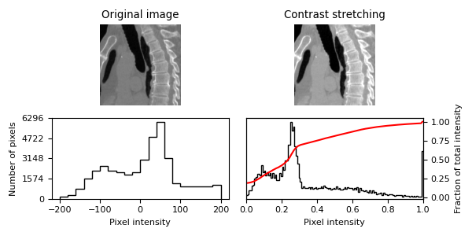
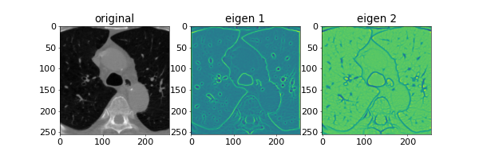
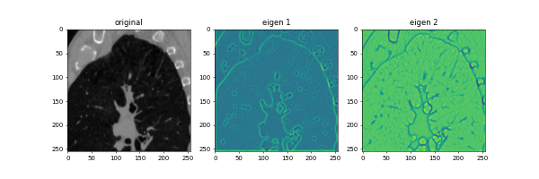
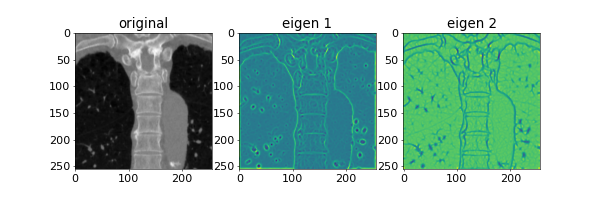
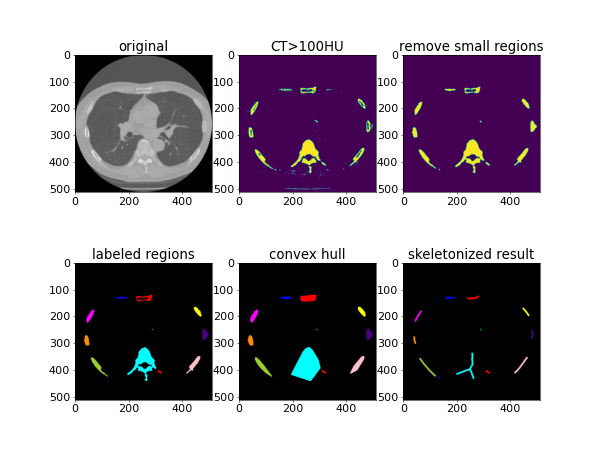
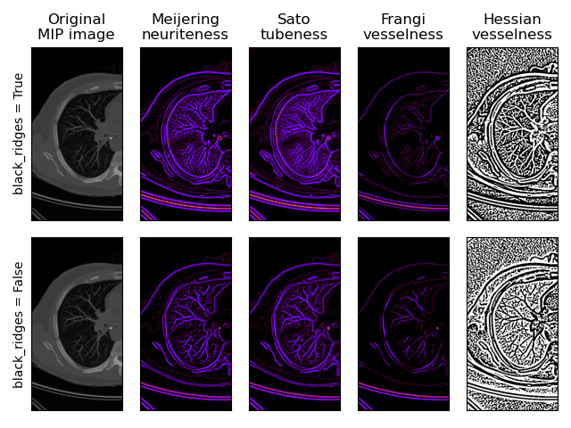

# AppSciImg

Simple exmaples of Scikit-image for medical images. 

Language: Python

# Demo
## CT value histogram
File name is [histogram2d.py](histogram2d.py). Original scikit-image example is [here](https://scikit-image.org/docs/stable/auto_examples/color_exposure/plot_equalize.html#sphx-glr-auto-examples-color-exposure-plot-equalize-py). The figure on the left is CT value histogram of a sagittal CT image. The lower and upper limits are set to -100 and 200. The figure on the right is a histogram of the rescaled intensity. 

## Eigen values of Hessian matrix for CT images (sigma=1.0)

## Labeling, convex hull, and skeleton of ribs and spine of CT image

## Detection of ridge-like structures in a MIP CT image.

# Author
Hidenobu SUZUKI

# License
"AppSciImg" is under [MIT license](https://en.wikipedia.org/wiki/MIT_License).
