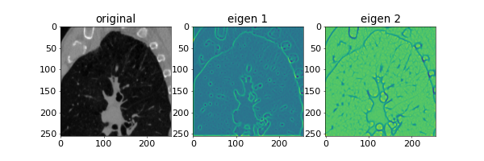

# AppSciImg

Simple exmaples of Scikit-image for medical images. 

Language: Python

# Demo
## CT value histogram
File name is [histogram2d.py](histogram2d.py). Original scikit-image example is [here](https://scikit-image.org/docs/stable/auto_examples/color_exposure/plot_equalize.html#sphx-glr-auto-examples-color-exposure-plot-equalize-py). The figure on the left is CT value histogram of a non-contrast chest sagittal CT image. The lower and upper limits are set to -200 and 200. The figure on the right is a histogram of the rescaled intensity. 


## Eigen values of Hessian matrix for CT images
File name is [hessian2d.py](hessian2d.py). Usage of hessian_matrix function is [here](https://scikit-image.org/docs/stable/api/skimage.feature.html?highlight=hessian_matrix#skimage.feature.hessian_matrix). The function was applied to non-contrast axial, sagittal, and coronal CT images. The parameter sigma was set to 1.0 as follows.
```
H_elems = hessian_matrix(input_img, sigma=1.0, order='rc')
```





## Labeling, convex hull, and skeleton of ribs and spine
File name is [skeleton2d.py](skeleton2d.py). This example consists of five steps. (1)Thresholding of CT value for coarse bone segmentation from a non-contrast CT image. (2)Applying a morphological closing for filling the holes in the bone regions, using [binary_closing](https://scikit-image.org/docs/dev/api/skimage.morphology.html?highlight=binary_closing#skimage.morphology.binary_closing). (3)Applying a morphological opening for remove small regions, using [binary_opening](https://scikit-image.org/docs/dev/api/skimage.morphology.html?highlight=binary_opening#skimage.morphology.binary_opening). (4)Convex hull to the bone regions, using [convex_hull_image](https://scikit-image.org/docs/dev/api/skimage.morphology.html?highlight=convex_hull_image#skimage.morphology.convex_hull_image). (5)Skeletonizing the bone regions, using [skeletonize](https://scikit-image.org/docs/dev/api/skimage.morphology.html?highlight=skeletonize#skimage.morphology.skeletonize). Finally, because of the difficulty of observing skeletonized thin lines, morphological dilation was applied.


## Detection of ridge-like structures in a MIP CT image.
File name is [ridge2d.py](ridge2d.py). Original scikit-image example is [here](https://scikit-image.org/docs/dev/auto_examples/edges/plot_ridge_filter.html#sphx-glr-auto-examples-edges-plot-ridge-filter-py). Four ridge filters were applied to non-contrast chest CT image.


# Author
Hidenobu SUZUKI

# License
"AppSciImg" is under [MIT license](https://en.wikipedia.org/wiki/MIT_License).
